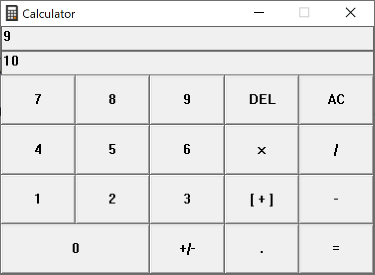

# Windows Calculator Win32

### What is this?
A stupid simple calculator based off Windows 10's own default calculator.
This program uses only C and the Win32 API for its GUI.

I have not tried this on anything other than my machine (Windows 10), but it should hopefully work. Feel free to create any issues if you encounter any problem.

### How does this work?
Read through main.c if you want to learn how the code works! It's all full of comments and I feel like I did a decent job at structuring/documenting the program.

Its user interface behaves similarly to Windows 10's default calculator. It supports both keyboard and mouse input.

### How to build?

Just use this:
`gcc src/main.c -std=c99 -mwindows -o win_cal`

I used this throughout development (extra warnings and errors, includes icon):
`gcc src/main.c res.o -o win_cal -std=c99 -mwindows -Wall -Wfatal-errors -Wextra -Werror`

### Final remarks
- Inspiration taken from https://mitxela.com/projects/windows_calculator
- Symbols in macros.h https://justine.lol/dox/cp437.txt
- This is pretty much the first time I use the Win32 api (like this). Don't expect perfect code, as I am still learning.
- The code was originally just in one file (main.c), I decided to split it like this so it would be more legible.
- Don't try this at home.
